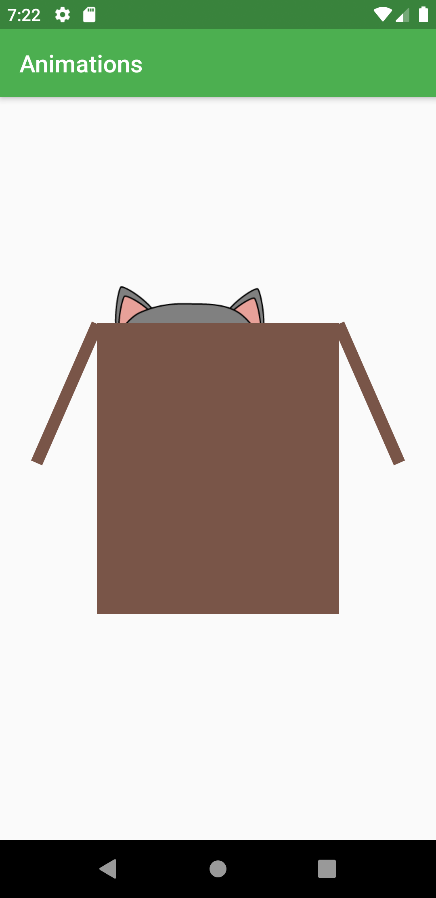
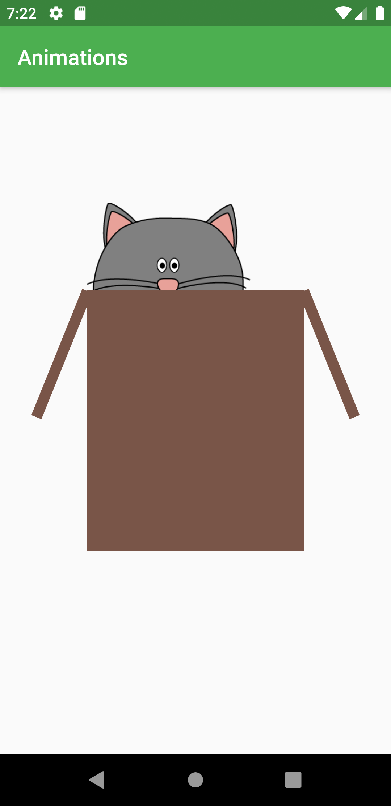

# Meow-Meow

* A basic Flutter application to learn animations in flutter.
* The entire application is inspired from the course of *Stephen Grider* on flutter available on Udemy.
* Check the app and contact for queries 

## Screenshots:

Until the cat is inside the box, the flaps of the box rotate a little along the axis pivoted at the joining point of the box.

The cat comes out of the box when you click it.
As soon as the cat is outside the box,the flaps stop to animate and cat stares at you.Beware!

